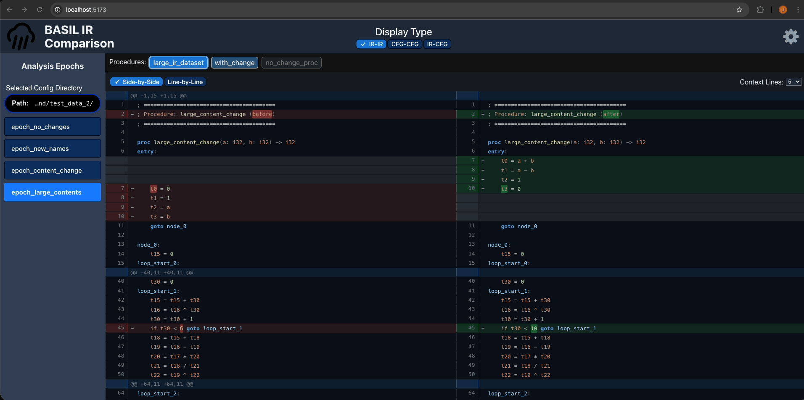
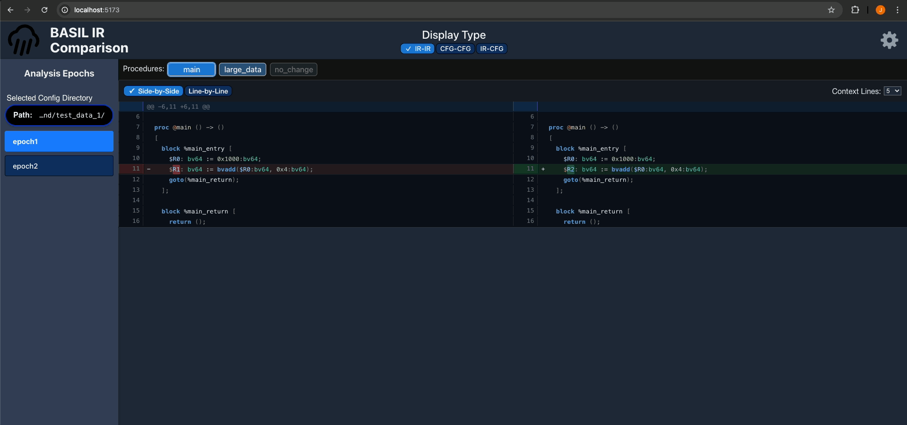

# Decompiler User Interface Project

A React + TypeScript frontend for visualising software in an Intermediate Representation (IR).

It allows comparison of raw IR code and Control Flow Graphs (CFGs) during compilation or decompilation. This project comes with a lightweight FastAPI (Python) backend for testing and development.

## Features

### View IR as plain text
High-fidelity representation of the intermediate representation.


### Visualise CFGs
Interactive graphs via React Flow — pan, zoom, and inspect nodes.


### Compare Epochs
Track changes across compilation stages with side-by-side highlighting.


## Frontend

- React, TypeScript, Vite, React Flow

## Backend
Important: This backend is designed as a modular bridge for testing and development. It is intended to be connected directly to your specific environment where your Intermediate Representation (IR) data resides to facilitate real-time visualisation and debugging.

- Python, FastAPI, Uvicorn


## Running the Project

### Backend
```bash
cd backend
```
```bash
pip install -r requirements.txt
```
```bash
uvicorn main:app --reload
```

Once the backend is running, you must load a valid configuration directory.

Two example datasets are provided:
- backend/test_data_1
- backend/test_data_2

You must provide the absolute path to one of these directories.

#### Option 1 - Using the interface
1. Click the **Configuration** button in the left-hand sidebar.
2. Enter the **absolute path** to one of the test data directories.
3. Confirm the selection to trigger the analysis.

 

Once selected, the backend will begin processing and report its readiness via the `/status` endpoint.

#### Option 2 - Using curl
```bash
curl -X POST http://127.0.0.1:8000/config/select-directory \
  -H "Content-Type: application/json" \
  -d '{"directoryPath":"/Users/{USR_PATH}/Decompiler-User-Interface-Project/backend/test_data_1"}'
```
If successful, the backend will respond:
```
{"message":"Analysis triggered"}
```

### Frontend
```bash
cd frontend
```
```bash
npm install
```
```bash
npm run dev
```


# Required API Endpoints

## 1. Get Available Epochs

Retrieves a list of all compilation snapshots available in the system.

Path: ```GET /epochs```

Response: string[] (e.g., ["01_parse", "02_inline", "03_optimize"])

## 2. Get Procedure IR (Plain Text)

Retrieves the raw text representation of a specific procedure.

Path: ```GET /ir/{epoch}/{procedureName}/{type}```

Params: type is either before or after.

Response: text/plain (The IR code block)

## 3. Get Epoch Procedure Index

Retrieves metadata and hashes for all procedures within a specific epoch.

Path: ```GET /ir/{epoch}/procedures```

Response: Array<{ name: string, beforeHash: string, afterHash: string }>

## 4. Get Control Flow Graph (CFG)

Retrieves the graph layout data (nodes/edges) for all procedures in an epoch.

Path: ```GET /cfg/{epoch}/{type}```

Response: Record<string, GraphJSON> (Keyed by procedure name)

## 5. Get Procedures with Line Mappings

Retrieves the line numbers for procedures within the full IR files to support navigation.

Path: ```GET /ir/{epoch}/procedures_with_lines```

Response: Array<{ name: string, startLine: number, approxEndLine: number }>

## 6. Get Full IR File

Retrieves the entire IR file for an epoch (used in the Diff view).

Path: ```GET /ir/{epoch}/{type}```

Params: type is either before or after.

Response: text/plain

## 7. Get Procedure List (Simple)

A simple list of procedure names for a specific epoch.

Path: ```GET /procedures/{epochName}```

Response: string[]

## 8. Get Analysis Status

Checks if the backend is currently active and ready.

Path: ```GET /status```

Response: JSON (System status object)

## 9. Select Working Directory

Tells the backend which directory to analyze.

Path: ```POST /config/select-directory```

Payload: { "directoryPath": "string" }

Response: 200 OK or Error message
